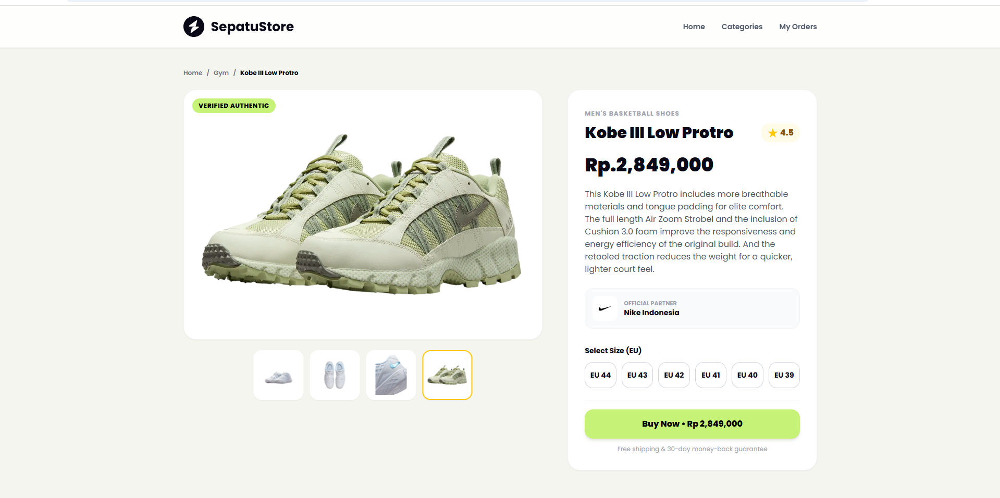
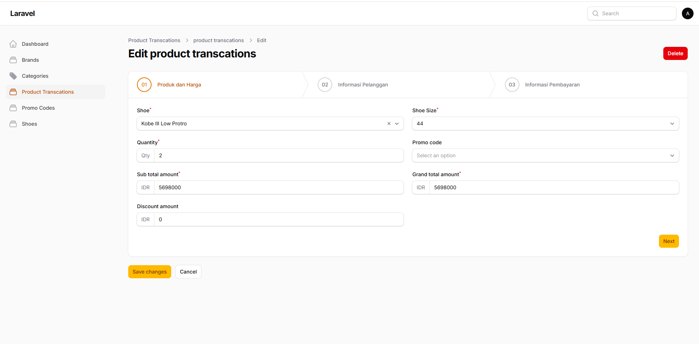

# 👟 ShoesStore

Platform toko sepatu online premium berbasis **Laravel 13** & **Livewire 3**. User bisa browse sepatu berdasarkan kategori & brand, order sepatu, upload bukti pembayaran, dan cek status pesanan via Booking ID.

> Dibuat mengikuti tutorial dari **BWA (Build With Angga)**.

## 📷 Tangkapan Layar (Screenshots)

### Frontend Overview


### Filament Admin Dashboard


---

## ✨ Fitur

### 🛍️ User / Customer
- **Browse sepatu** — lihat semua sepatu di beranda
- **Browse by kategori** — filter sepatu berdasarkan kategori (Lifestyle, Running, Gym, Basketball)
- **Browse by brand** — lihat sepatu dari brand tertentu
- **Detail sepatu** — lihat foto, harga, deskripsi, brand, ukuran, dan pilih size
- **Order sepatu** — isi nama, email, phone, alamat, jumlah, dan kode promo
- **Upload bukti pembayaran** — upload foto bukti transfer
- **Lihat order selesai** — halaman konfirmasi setelah order
- **Cek pesanan (My Orders)** — cek status pesanan via Booking ID + nomor HP
- **Search sepatu** — cari sepatu berdasarkan nama

### 🧱 Tech Stack & Pola
- **Laravel 13.30.1** + **PHP 8.5.1**
- **Livewire 3** untuk form quantity & promo yang reaktif
- **Repository Pattern + Service Pattern + Dependency Injection**
- **Form Request Validation** (`StoreCustomerDataRequest`, `StorePaymentRequest`, `StoreCheckBookingRequest`)
- **Soft Deletes** di hampir semua tabel
- **Session-based cart/order** (`saveToSession`)

---

## 📦 Instalasi

### Prasyarat
Pastikan sudah punya:
- PHP ≥ 8.2
- Composer
- Node.js & NPM
- MySQL / MariaDB
- Git

### Langkah Instalasi

**1. Clone repository**
```bash
git clone <url-repo>
cd sepatustore
```

**2. Install dependency PHP**
```bash
composer install
```

**3. Install dependency JavaScript**
```bash
npm install
```

**4. Copy file `.env`**
```bash
cp .env.example .env
```

**5. Generate APP_KEY**
```bash
php artisan key:generate
```

**6. Konfigurasi database** — buka `.env`, sesuaikan:
```env
DB_CONNECTION=mysql
DB_HOST=127.0.0.1
DB_PORT=3306
DB_DATABASE=sepatustore
DB_USERNAME=root
DB_PASSWORD=
```

**7. Buat database baru**
```sql
CREATE DATABASE sepatustore;
```

**8. Jalankan migrasi**
```bash
php artisan migrate
```

**9. Buat storage symlink** (supaya file di `storage/app/public` bisa diakses dari web)
```bash
php artisan storage:link
```

**10. Build asset frontend**
```bash
npm run build
```

---

## 🚀 Cara Menjalankan Project

### Development (2 terminal)

**Terminal 1 — Laravel server:**
```bash
php artisan serve
```
Buka `http://127.0.0.1:8000`

**Terminal 2 — Vite (live reload asset):**
```bash
npm run dev
```

### Production
```bash
npm run build
php artisan serve
```

---

## 🌱 Seeder (Data Dummy)

Seeder sudah menyiapkan:
- **4 Kategori:** Lifestyle, Running, Gym, Basketball
- **4 Brand:** Nike, Adidas, Jordan, Puma
- **8 Sepatu** lengkap dengan foto & ukuran (38–45)

### Cara menjalankan seeder:

**Jalankan semua seeder (termasuk default User):**
```bash
php artisan db:seed
```

**Jalankan hanya ShoeSeeder:**
```bash
php artisan db:seed --class=ShoeSeeder
```

**Reset database + jalankan ulang semua seeder:**
```bash
php artisan migrate:fresh --seed
```

---

## 🔗 Storage Link

`storage:link` membuat symlink dari `public/storage` → `storage/app/public`. Ini penting supaya foto sepatu dan bukti pembayaran user bisa ditampilkan di browser.

```bash
php artisan storage:link
```

Kalau error "symlink already exists", hapus dulu:
```bash
# Windows (PowerShell)
Remove-Item public\storage
# Linux / Mac
rm public/storage
```
Lalu jalankan ulang `php artisan storage:link`.

---

## 📂 Struktur Penting

```
sepatustore/
├── app/
│   ├── Http/Controllers/
│   │   ├── FrontController.php      # Beranda, detail, kategori, search
│   │   └── OrderController.php      # Booking, payment, cek pesanan
│   ├── Http/Requests/              # Validasi form
│   ├── Models/                     # Eloquent models
│   ├── Repositories/               # Repository pattern
│   └── Services/                   # Business logic
├── database/
│   ├── migrations/
│   └── seeders/ShoeSeeder.php      # Seeder 8 sepatu
├── resources/views/
│   ├── front/                      # Halaman user
│   ├── order/                      # Halaman order/booking
│   └── livewire/order-form.blade.php
└── routes/web.php
```

---

## 🛣️ Route Utama

| Method | URL                          | Nama Route                  |
|--------|------------------------------|-----------------------------|
| GET    | /                            | front.index                 |
| GET    | /browse/{category:slug}      | front.category              |
| GET    | /details/{shoe:slug}         | front.details               |
| GET    | /search?keyword=...          | front.search                |
| GET    | /check-booking               | front.check_booking         |
| POST   | /check-booking/details       | front.check_booking_details |
| GET/POST| /order/begin/{shoe:slug}    | front.save_order            |
| GET    | /order/booking               | front.booking               |
| GET    | /order/booking/customer-data | front.customer_data         |
| POST   | /order/booking/customer-data/save | front.save_customer_data |
| GET    | /order/payment               | front.payment               |
| POST   | /order/payment/confirm       | front.payment_comfirm       |
| GET    | /order/finished/{id}         | front.order_finished        |

---

